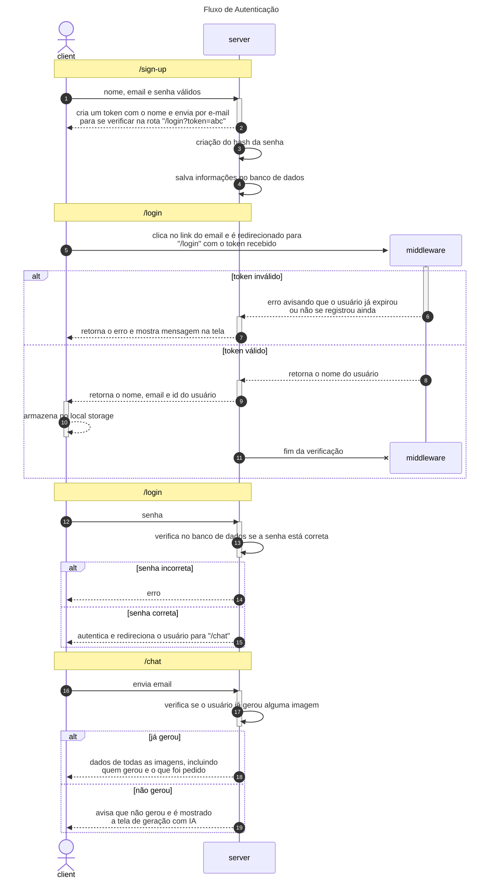

# AI-photos-community

> Resultado final (tamanho de imagens modificado para melhor visualização)


<br>

## 📋 Conteúdo

- [Visão Geral](#Overview)
- [Previews](#previews)
- [Tecnologias utilizadas](#techs)
- [Instrução de instalação](#installation)
  - [Pré-requisitos](#prerequisites)
  - [Clonando Repositório](#cloning-repo)
  - [Configuração do Projeto](#config)
    - [Back-End](#back-end)
    - [Front-End](#front-end)
- [Instrução de uso](#use)
- [AI-photos-community endpoints](#photos-community-endpoints)
- [Fluxo de autenticação](#auth-flow)
- [Licença](#license)

<br>

<a name="Overview"></a>
## 🔍 Visão Geral

O sistema desenvolvido é uma plataforma que funciona como uma "comunidade de fotos", onde os usuários podem gerar e compartilhar imagens geradas por uma IA de forma colaborativa. 
Para acessar as funcionalidades, os usuários precisam se autenticar por meio de um sistema de cadastro simples, sign-up e login (registrar e entrar), que inclui a 
verificação de e-mail e a utilização de tokens JWT. Após a autenticação, os usuários conseguem gerar imagens utilizando a API da Stability AI, integrada ao sistema.

O projeto enfrenta uma limitação relacionada ao plano padrão da API da Stability AI, que permite a geração de apenas 8 imagens por usuário, álem de possuir um limite diário de requisições.

Este projeto teve como objetivo principal reunir todos os meus conhecimentos adquiridos até o momento e aplicá-los de maneira prática.

<a name="previews"></a>
## 👀 Previews

<details>
<summary>📄 Documentação das rotas com Scalar API <ins>(Clique para expandir)</ins></summary>
<div align="center">
  
  
  
</div>
</details>

<details>
<summary>📷 Página inicial <ins>(Clique para expandir)</ins></summary>
<div align="center">
  
  
  
</div>
</details>

<details>
<summary>📷 Página para se registrar (mostrando erros da validação) <ins>(Clique para expandir)</ins></summary>
<div align="center">
  
  
  
</div>
</details>

<details>
<summary>📷 Página de Login, sem estar registrado <ins>(Clique para expandir)</ins></summary>
<div align="center">
  
  
  
</div>
</details>

<details>
<summary>✉️ Mensagens de e-mail enviado <ins>(Clique para expandir)</ins></summary>
<div align="center">
  
  
  
  
</div>
</details>

<details>
<summary>✉️ E-mail recebido <ins>(Clique para expandir)</ins></summary>
<div align="center">
  
  
  
</div>
</details>

<details>
<summary>📷 Página de login após e-mail confirmado (com erro de validação) <ins>(Clique para expandir)</ins></summary>
<div align="center">
  
  
  
</div>
</details>

<details>
<summary>📷 Página do chat após fazer login com sucesso <ins>(Clique para expandir)</ins></summary>
<div align="center">
  
  
  
</div>
</details>

<details>
<summary>🎥 Simulação da geração de uma imagem <ins>(Clique para expandir)</ins></summary>
<div align="center">
  
https://github.com/user-attachments/assets/713c84a2-299f-4f22-a546-3aaf501ee947
  
</div>
</details>

<br>

<a name="techs"></a>
## 🛠️ Tecnologias utilizadas
<a href="https://fastify.dev/docs/latest/Guides/Getting-Started/"></a> <a href="https://www.typescriptlang.org/docs/"></a> <a href="https://zod.dev/"></a> <a href="https://nodejs.org/pt"></a> <a href="https://www.mongodb.com/docs/"></a> <a href="https://learning.postman.com/docs/introduction/overview/"></a> <a href="https://jwt.io/"></a> <a href="https://vite.dev/guide/"></a>

**Insalador de pacotes**:  
<a href="https://docs.npmjs.com"></a>

<br>

<a name="installation"></a>
## ⚙️ Instrução de instalação

<a name="prerequisites"></a>
### 📦 Pré-requisitos
> [!IMPORTANT]
> **Possuir uma "senha de app" do google**  
> [Tutorial para criar uma senha de app](https://support.google.com/accounts/answer/185833?hl=pt-br)

- **Um e-mail comum ou para testes**

- **Criar uma conta (ou entrar com e-mail do google) na Stability AI e anotar a API_KEY do perfil**. [Acessar Stability AI](https://platform.stability.ai/)

> [!caution]
> **Para gerar imagens utilizando a API da Stability AI, o usuário precisa de `"créditos"`. Todo novo usuário**  
> **recebe 25 créditos iniciais para geração de imagens. Além disso, existe um limite de requisições que podem**  
> **ser feitas para o servidor em um determinado período de tempo (Esse limite é importante para evitar sobrecarga**  
> **no servidor e garantir que todos os usuários tenham acesso justo aos recursos). Com o modelo `Stable Image Core`,**  
> **(que está sendo utilizado) que custa 3 créditos por imagem, é possível gerar 8 imagens com os 25 créditos iniciais.**

Para a instalação dos frameworks, middlewares e dependências que possibilitaram a criação do Sistema  
é necessário que você possua as seguintes ferramentas:

- &nbsp; **Node.js** - [Tutorial de instalação](https://nodejs.org/pt)

- &nbsp; **npm** - [Tutorial de instalação](https://docs.npmjs.com/downloading-and-installing-node-js-and-npm)

- &nbsp; **Mongo DB Atlas** - [Tutorial de configuração](https://www.mongodb.com/pt-br/docs/atlas/)

Para fazer requisições e testar as respostas da API:
- &nbsp; **Postman** - [Tutorial de instalação](https://www.postman.com/downloads/)

> [!tip]
> Também é possível fazer requisições pela linha de comando. &nbsp;  
[Clique aqui](https://www.campuscode.com.br/conteudos/comandos-curl-para-testar-requisicoes-api) para aprender a fazer requisições pelo terminal

<br>

<a name="cloning-repo"></a>
### 💻 Clonando Repositório
No Terminal, certifique de que você está na pasta onde vai ficar o repositório

`repositorios\clonados`
``` bash
git clone https://github.com/henrygoncalvess/AI-photos-community.git
```

certifique de que exista um arquivo chamado `.gitignore` na raiz do projeto  
com pelo menos a extensão de arquivo "`.env`" incluída

`repositorios\clonados\AI-photos-community\.gitignore`
``` .env
.env
node_modules/
uploads/
package.json
package-lock.json
tsconfig.json
vite.config.js
```

<br>

<a name="config"></a>
### ⚙️ Configuração do Projeto

<a name="back-end"></a>
### Back-End

#### 1. Inicialize o projeto Node.js

`repositorios\clonados\AI-photos-community\back-end`
``` bash
npm init
```

#### 2. Adicione o seguinte código ao package.json:

`repositorios\clonados\AI-photos-community\back-end\package.json`
``` json
"scripts": {
  "dev": "tsx --watch src/server.ts"
},
"dependencies": {
  "@fastify/cors": "10.0.2",
  "@fastify/static": "8.0.4",
  "@fastify/swagger": "9.4.0",
  "@scalar/fastify-api-reference": "1.25.100",
  "axios": "1.7.9",
  "bcryptjs": "2.4.3",
  "dotenv": "16.4.7",
  "fastify": "5.2.0",
  "fastify-type-provider-zod": "4.0.2",
  "form-data": "4.0.1",
  "jsonwebtoken": "9.0.2",
  "mongodb": "6.12.0",
  "nodemailer": "6.9.16",
  "zod": "3.24.1"
},
"devDependencies": {
  "@types/bcryptjs": "2.4.6",
  "@types/jsonwebtoken": "9.0.7",
  "@types/node": "22.10.5",
  "@types/nodemailer": "6.4.17",
  "tsx": "4.19.2",
  "typescript": "5.7.2"
}
```

#### 3. com as dependências listadas em `package.json`, inicie a instalação.

`repositorios\clonados\AI-photos-community\back-end`
``` bash
npm install
```

#### 4. Inicialize o TypeScript e configure o arquivo `tsconfig.json`.

`repositorios\clonados\AI-photos-community\back-end`
``` bash
npx tsc --init
```

#### 5. Atualize o `tsconfig.json` com as seguintes configurações básicas:
_este padrão de arquivo typescript está de acordo com esta [documentação](https://github.com/tsconfig/bases)_  
_baseado na versão node utilizada_

`repositorios\clonados\AI-photos-community\back-end\tsconfig.json`
``` json
{
  "$schema": "https://json.schemastore.org/tsconfig",
  "display": "Node 22",
  "_version": "22.0.0",

  "compilerOptions": {
    "lib": ["es2023"],
    "module": "node16",
    "target": "es2022",

    "noImplicitAny": false,
    "strict": true,
    "esModuleInterop": true,
    "skipLibCheck": true,
    "moduleResolution": "node16"
  }
}
```

**6. crie o arquivo `.env` na raiz do projeto.**  
**configure as variáveis de acordo com seus dados.**  
**utilize a senha de aplicativo que foi criada em** [Tutorial para criar uma senha de app](#pré-requisitos)

`repositorios\clonados\AI-photos-community\back-end`
``` .env
EMAIL = "seu-email@gmail.com"
PASSWORD_EMAIL = "sua senha de aplicativo"
URI_MONGODB = "sua string de conexão do cluster"
DATABASE = "nome do banco de dados"
COLLECTION = "nome da coleção dentro do banco de dados"
JWT_SECRET = "uma senha secreta"
STABILITY_API_KEY = "sua api_key no perfil do Stability AI"
```

<br>

<a name="front-end"></a>
### Front-End

#### 1. Inicialize o projeto Node.js

`repositorios\clonados\AI-photos-community\front-end`
``` bash
npm init
```

#### 2. Adicione o seguinte código ao package.json:

`repositorios\clonados\AI-photos-community\front-end\package.json`
``` json
"scripts": {
  "dev": "npx vite"
},
"dependencies": {
  "zod": "3.24.1"
},
"devDependencies": {
  "vite": "6.0.7"
}
```

> [!IMPORTANT]
> Certifique-se de que:  
> `"type": "module"` dentro de `package.json`

#### 3. com as dependências listadas em `package.json`, inicie a instalação

`repositorios\clonados\AI-photos-community\front-end`
``` bash
npm install
```

#### 4. Crie um arquivo chamado `vite.config.js` na raiz do projeto e configure-o

`repositorios\clonados\AI-photos-community\front-end\vite.config.js`
``` js
import { defineConfig } from "vite";

export default defineConfig({
    root: "public",
    server: {
        port: 3001,
        open: "home.html"
    }
})
```

<br>

<a name="use"></a>
## 📜 Instrução de uso

#### 1. inicie o servidor de back-end em um terminal.

`repositorios\clonados\AI-photos-community\back-end`
``` bash
npm run dev
```

#### 2. inicie o servidor de front-end em outro terminal.

`repositorios\clonados\AI-photos-community\front-end`
``` bash
npm run dev
```

<br>

<a name="photos-community-endpoints"></a>
## 📍 AI-photos-community endpoints

No Postman *ou na linha de comando*  
teste manualmente as respostas da API do sistema seguindo os **endpoints** abaixo.

> [!tip]
> &nbsp; acesse este link, caso não saiba utilizar o Postman para fazer requisições [Postman](https://learning.postman.com/docs/introduction/overview/) &nbsp;  
> &nbsp; acesse este link, caso não saiba fazer requisições pela linha de comando [Clique aqui](https://www.campuscode.com.br/conteudos/comandos-curl-para-testar-requisicoes-api) &nbsp;

#### em seu navegador, acesse [`http://localhost:3000/docs`](http://localhost:3000/docs) para acessar a documentação das rotas

`PRÉVIA`:


<a name="auth-flow"></a>
## 🔐 Fluxo de autenticação



<br>

<a name="license"></a>
## 📄 Licença

Este projeto está licenciado sob a [MIT License](https://github.com/henrygoncalvess/AI-photos-community/blob/main/LICENSE).

---

<div align="center">
  <p>Feito com ❤️ por <a href="https://github.com/henrygoncalvess">Henry Gonçalves</a></p>
  <p>Deixe uma ⭐ no repositório se ele for útil para você!</p>
</div>
