# AI-photos-community

descrição

Prévia do projeto: 📷 [ver fotos](project-preview.md) 📷

<br>

**licença e tecnologias utilizadas**:  
 <a href="https://fastify.dev/docs/latest/Guides/Getting-Started/"></a> <a href="https://www.typescriptlang.org/docs/"></a> <a href="https://zod.dev/"></a> <a href="https://nodejs.org/pt"></a> <a href="https://www.mongodb.com/docs/"></a> <a href="https://learning.postman.com/docs/introduction/overview/"></a> <a href="https://jwt.io/"></a> <a href="https://vite.dev/guide/"></a>

**Insalador de pacotes**:  
<a href="https://docs.npmjs.com"></a>

**Ponto de Entrada**:  
<span></span>

**Caminho**:  
<span></span>

<br>

<details open="open">
<summary>Tabela de Conteúdos</summary>
  
- [Instrução de instalação](#instrução-de-instalação)
  - [Pré-requisitos](#pré-requisitos)
  - [Clonando Repositório](#clonando-repositório)
  - [Configuração do Projeto](#configuração-do-projeto)
    - [Back-End](#back-end)
    - [Front-End](#front-end)
- [Instrução de uso](#instrução-de-uso)
- [AI-photos-community endpoints](#ai-photos-community-endpoints)
- [Fluxo de autenticação](#fluxo-de-autenticação)

``` mermaid
---
title:  Estrutura de pastas (back-end)
---
flowchart LR
    sistema("📁 _AI_photos_community_")@{ shape: processes }
    sistema --o back("📁 _back-end_")@{ shape: processes }
    back ---o src("📁 _src_")@{ shape: processes }
    src --o config("📁 _config_")@{ shape: processes }
    config --- db.ts("📄 **db.ts**")@{ shape: card }
    src --o controllers("📁 _controllers_")@{ shape: processes }
    controllers --- authController.ts("📄 **authController.ts**")@{ shape: card }
    controllers --- chatController.ts("📄 **chatController.ts**")@{ shape: card }
    controllers --- usersController.ts("📄 **usersController.ts**")@{ shape: card }
    src --o middle("📁 _middlewares_")@{ shape: processes }
    middle --- auth.ts("📄 **auth.ts**")@{ shape: card }
    src --o models("📁 _models_")@{ shape: processes }
    models --- authModel.ts("📄 **authModel.ts**")@{ shape: card }
    models --- chatModel.ts("📄 **chatModel.ts**")@{ shape: card }
    models --- usersModel.ts("📄 **authModel.ts**")@{ shape: card }
    src --o routes("📁 _routes_")@{ shape: processes }
    routes --- login.ts("📄 **login.ts**")@{ shape: card }
    routes --- chat.ts("📄 **chat.ts**")@{ shape: card }
    routes --- users.ts("📄 **users.ts**")@{ shape: card }
    src --o services("📁 _services_")@{ shape: processes }
    services --- email.ts("📄 **email.ts**")@{ shape: card }
    services --- generateImage.ts("📄 **generateImage.ts**")@{ shape: card }
    src --o types("📁 _types_")@{ shape: processes }
    types --- authInterface.ts("📄 **authInterface.ts**")@{ shape: card }
    types --- fastify.ts("📄 **fastify.ts**")@{ shape: card }
    src --o utils("📁 _utils_")@{ shape: processes }
    utils --- checkDocument.ts("📄 **checkDocument.ts**")@{ shape: card }
    utils --- connectCollections.ts("📄 **connectCollections.ts**")@{ shape: card }
    utils --- createHTMLMessage.ts("📄 **createHTMLMessage.ts**")@{ shape: card }
    utils --- decryptUser.ts("📄 **decryptUser.ts**")@{ shape: card }
    utils --- encryptAuthUser.ts("📄 **encryptAuthUser.ts**")@{ shape: card }
    src --- app.ts("📄 **app.ts**")@{ shape: card }
    src --- server.ts("📄 **server.ts**")@{ shape: card }
    back --o uploads("📁 _uploads_")@{ shape: processes }
    back --o env("⚙️ .env")
    



    %%CLASSES
    classDef default fill:#191919,color:white;
    
    classDef pasta fill:#403211,stroke:#c99e34,stroke-width:2px,color:#fff1cc;

    classDef envStyle fill:#000000,stroke:#000000,color:gray;

    %%aplicação de classes
    class sistema,back,src,config,controllers,middle,models,routes,services,utils,types,uploads pasta

    class env envStyle



    %%LINKS
    
    %%pastas
    linkStyle 0,1,2,4,8,10,14,18,21,24 stroke:#f2c04b

    %%arquivos
    linkStyle default stroke-width:2px;
```

``` mermaid
---
title:  Estrutura de pastas (fron-ent)
---
flowchart LR
    sistema("📁 _AI_photos_community_")@{ shape: processes }
    sistema --o front("📁 _front-end_")@{ shape: processes }
    front ---o public("📁 _public_")@{ shape: processes }
    public --- index.html("📄 **index.html**")@{ shape: card }
    public --- email.html("📄 **email.html**")@{ shape: card }
    public --o css("📁 _css_")@{ shape: processes }
    public --o images("📁 _images_")@{ shape: processes }
    public --o src("📁 _src_")@{ shape: processes }
    css --- chat.css("📄 **chat.css**")@{ shape: card }
    css --- home.css("📄 **home.css**")@{ shape: card }
    css --- login.css("📄 **login.css**")@{ shape: card }
    css --- sign.css("📄 **sign-up.css**")@{ shape: card }
    images --- background.png("📄 **background.png**")@{ shape: card }
    images --- important_icon.png("📄 **important_icon.png**")@{ shape: card }
    images --- verified_icon.png("📄 **verified_icon.png**")@{ shape: card }
    src ---o components("📁 _components_")@{ shape: processes }
    src ---o pages("📁 _pages_")@{ shape: processes }
    src ---o services("📁 _services_")@{ shape: processes }
    src ---o utils("📁 _utils_")@{ shape: processes }
    src ---- App.js("📄 **App.js**")@{ shape: card }
    src ---- main.js("📄 **main.js**")@{ shape: card }
    components --- Button.js("📄 **Button.js**")@{ shape: card }
    components --- InputForm.js("📄 **InputForm.js**")@{ shape: card }
    components --- LoadingScreen.js("📄 **LoadingScreen.js**")@{ shape: card }
    components --- LoginError.js("📄 **LoginError.js**")@{ shape: card }
    components --- SetupLoginForm.js("📄 **SetupLoginForm.js**")@{ shape: card }
    components --- Sign-upMessage.js("📄 **Sign-upMessage.js**")@{ shape: card }
    pages --- chat.js("📄 **chat.js**")@{ shape: card }
    pages --- home.js("📄 **home.js**")@{ shape: card }
    pages --- login.js("📄 **login.js**")@{ shape: card }
    pages --- sign.js("📄 **sign-up.js**")@{ shape: card }
    services --- checkUserImage.js("📄 **checkUserImage.js**")@{ shape: card }
    services --- confirmLogin.js("📄 **confirmLogin.js**")@{ shape: card }
    services --- generateImage.js("📄 **generateImage.js**")@{ shape: card }
    services --- handleAuthorization.js("📄 **handleAuthorization.js**")@{ shape: card }
    services --- sendVerificationEmail.js("📄 **sendVerificationEmail.js**")@{ shape: card }
    services --- showImages.js("📄 **showImages.js**")@{ shape: card }
    utils --- validator.js("📄 **validator.js**")@{ shape: card }



    %%CLASSES
    classDef default fill:#191919,color:white;
    
    classDef pasta fill:#403211,stroke:#c99e34,stroke-width:2px,color:#fff1cc;

    classDef envStyle fill:#000000,stroke:#000000,color:gray;

    %%aplicação de classes
    class sistema,front,public,css,images,src,components,pages,services,utils pasta



    %%LINKS
    
    %%pastas
    linkStyle 0,1,4,5,6,14,15,16,17 stroke:#f2c04b

    %%arquivos
    linkStyle default stroke-width:2px;
```
  
</details>

<br>





<br>

## Instrução de instalação

### Pré-requisitos
> [!IMPORTANT]
> **Possuir uma "senha de app" do google**  
> [Tutorial para criar uma senha de app](https://support.google.com/accounts/answer/185833?hl=pt-br)

- **Um e-mail comum ou para testes**

- **Criar uma conta (ou entrar com e-mail do google) na Stability AI e anotar a API_KEY do perfil**. [Acessar Stability AI](https://platform.stability.ai/)

> [!caution]
> **Para gerar imagens utilizando a API da Stability AI, o usuário precisa de `"créditos"`. Todo novo usuário**  
> **recebe 25 créditos iniciais para geração de imagens. Além disso, existe um limite de requisições que podem**  
> **ser feitas para o servidor em um determinado período de tempo (Esse limite é importante para evitar sobrecarga**  
> **no servidor e garantir que todos os usuários tenham acesso justo aos recursos). Com o modelo `SD3-Medium`,**  
> **(que está sendo utilizado) que custa 3,5 créditos por imagem, é possível gerar 7 imagens com os 25 créditos iniciais.**

Para a instalação dos frameworks, middlewares e dependências que possibilitaram a criação do Sistema  
é necessário que você possua as seguintes ferramentas:

- &nbsp; **Node.js** - [Tutorial de instalação](https://nodejs.org/pt)

- &nbsp; **npm** - [Tutorial de instalação](https://docs.npmjs.com/downloading-and-installing-node-js-and-npm)

- &nbsp; **Mongo DB Atlas** - [Tutorial de configuração](https://www.mongodb.com/pt-br/docs/atlas/)

Para fazer requisições e testar as respostas da API:
- &nbsp; **Postman** - [Tutorial de instalação](https://www.postman.com/downloads/)

> [!tip]
> &nbsp; Também é possível fazer requisições pela linha de comando. &nbsp;  
[Clique aqui](https://www.campuscode.com.br/conteudos/comandos-curl-para-testar-requisicoes-api) para aprender a fazer requisições pelo terminal

<br>

### Clonando Repositório
No Terminal, certifique de que você está na pasta onde vai ficar o repositório

`repositorios\clonados`
``` bash
git clone https://github.com/henrygoncalvess/AI-photos-community.git
```

certifique de que exista um arquivo chamado `.gitignore` na raiz do projeto  
com pelo menos a extensão de arquivo "`.env`" incluída

`repositorios\clonados\AI-photos-community\.gitignore`
``` .env
.env
node_modules/
package.json
package-lock.json
tsconfig.json
vite.config.js
```

<br>

### Configuração do Projeto

### Back-End

#### 1. Inicialize o projeto Node.js

`repositorios\clonados\AI-photos-community\back-end`
``` bash
npm init
```

#### 2. Adicione o seguinte código ao package.json:

`repositorios\clonados\AI-photos-community\back-end\package.json`
``` json
"scripts": {
  "dev": "tsx --watch src/server.ts"
},
"dependencies": {
  "@fastify/cors": "10.0.2",
  "@fastify/static": "8.0.4",
  "@fastify/swagger": "9.4.0",
  "@scalar/fastify-api-reference": "1.25.100",
  "axios": "1.7.9",
  "bcryptjs": "2.4.3",
  "dotenv": "16.4.7",
  "fastify": "5.2.0",
  "fastify-type-provider-zod": "4.0.2",
  "form-data": "4.0.1",
  "jsonwebtoken": "9.0.2",
  "mongodb": "6.12.0",
  "nodemailer": "6.9.16",
  "zod": "3.24.1"
},
"devDependencies": {
  "@types/bcryptjs": "2.4.6",
  "@types/jsonwebtoken": "9.0.7",
  "@types/node": "22.10.5",
  "@types/nodemailer": "6.4.17",
  "tsx": "4.19.2",
  "typescript": "5.7.2"
}
```

#### 3. com as dependências listadas em `package.json`, inicie a instalação.

`repositorios\clonados\AI-photos-community\back-end`
``` bash
npm install
```

#### 4. Inicialize o TypeScript e configure o arquivo `tsconfig.json`.

`repositorios\clonados\AI-photos-community\back-end`
``` bash
npx tsc --init
```

#### 5. Atualize o `tsconfig.json` com as seguintes configurações básicas:
_este padrão de arquivo typescript está de acordo com esta [documentação](https://github.com/tsconfig/bases)_  
_baseado na versão node utilizada_

`repositorios\clonados\AI-photos-community\back-end\tsconfig.json`
``` json
{
  "$schema": "https://json.schemastore.org/tsconfig",
  "display": "Node 22",
  "_version": "22.0.0",

  "compilerOptions": {
    "lib": ["es2023"],
    "module": "node16",
    "target": "es2022",

    "noImplicitAny": false,
    "strict": true,
    "esModuleInterop": true,
    "skipLibCheck": true,
    "moduleResolution": "node16"
  }
}
```

**6. crie o arquivo `.env` na raiz do projeto.**  
**configure as variáveis de acordo com seus dados.**  
**utilize a senha de aplicativo que foi criada em** [Tutorial para criar uma senha de app](#pré-requisitos)

`repositorios\clonados\AI-photos-community\back-end`
``` .env
EMAIL = "seu-email@gmail.com"
PASSWORD_EMAIL = "sua senha de aplicativo"
URI_MONGODB = "sua string de conexão do cluster"
DATABASE = "nome do banco de dados"
COLLECTION = "nome da coleção dentro do banco de dados"
JWT_SECRET = "uma senha secreta"
STABILITY_API_KEY = "sua api_key no perfil do Stability AI"
```

<br>

### Front-End

#### 1. Inicialize o projeto Node.js

`repositorios\clonados\AI-photos-community\front-end`
``` bash
npm init
```

#### 2. Adicione o seguinte código ao package.json:

`repositorios\clonados\AI-photos-community\front-end\package.json`
``` json
"scripts": {
  "dev": "npx vite"
},
"dependencies": {
  "zod": "3.24.1"
},
"devDependencies": {
  "vite": "6.0.7"
}
```

> [!IMPORTANT]
> Certifique-se de que:  
> `"type": "module"` dentro de `package.json`

#### 3. com as dependências listadas em `package.json`, inicie a instalação

`repositorios\clonados\AI-photos-community\front-end`
``` bash
npm install
```

#### 4. Crie um arquivo chamado `vite.config.js` na raiz do projeto e configure-o

`repositorios\clonados\AI-photos-community\front-end\vite.config.js`
``` js
import { defineConfig } from "vite";

export default defineConfig({
    root: "public",
    server: {
        port: 3001,
        open: "home.html"
    }
})
```

<br>

## Instrução de uso

#### 1. inicie o servidor de back-end em um terminal.

`repositorios\clonados\AI-photos-community\back-end`
``` bash
npm run dev
```

#### 2. inicie o servidor de front-end em outro terminal.

`repositorios\clonados\AI-photos-community\front-end`
``` bash
npm run dev
```

<br>

## AI-photos-community endpoints

No Postman *ou na linha de comando*  
teste manualmente as respostas da API do sistema seguindo os **endpoints** abaixo.

> [!tip]
> &nbsp; acesse este link, caso não saiba utilizar o Postman para fazer requisições [Postman](https://learning.postman.com/docs/introduction/overview/) &nbsp;  
> &nbsp; acesse este link, caso não saiba fazer requisições pela linha de comando [Clique aqui](https://www.campuscode.com.br/conteudos/comandos-curl-para-testar-requisicoes-api) &nbsp;

#### em seu navegador, acesse [`http://localhost:3000/docs`](http://localhost:3000/docs) para acessar a documentação das rotas

`PRÉVIA`:


## Fluxo de autenticação

``` mermaid

```